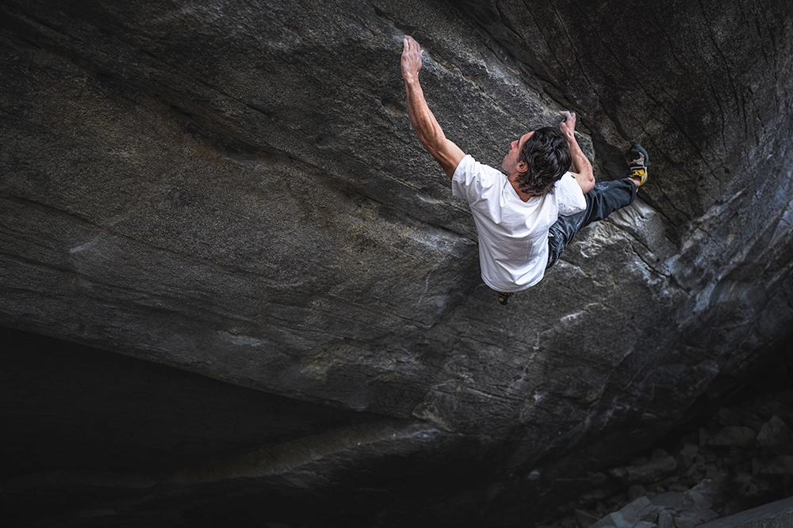
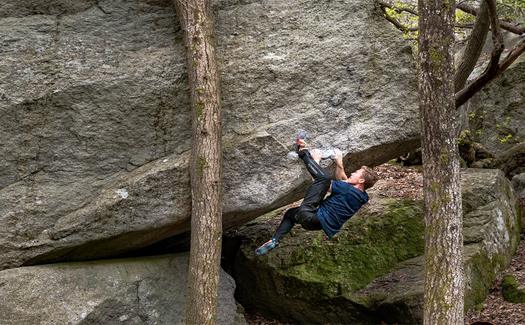

# Bouldering

## What is Bouldering?
Bouldering is a form of rock climbing performed on small rock formations or artificial walls without the use of ropes or harnesses. Climbers rely on crash pads for protection and focus on short but challenging routes known as "problems."

## Equipment Needed
- Climbing Shoes
- Chalk and Chalk Bag
- Crash Pads
- Brush for Cleaning Holds

## Basic Techniques
1. **Footwork** - Precise foot placements improve balance and efficiency.
2. **Body Positioning** - Using body tension to stay on the wall.
3. **Dynos** - Jumping from one hold to another.
4. **Crimping** - Using fingertips to grip small holds.
5. **Mantling** - Pushing down on a hold to move upward.

## Popular Bouldering Locations
- Fontainebleau, France
- Rocklands, South Africa
- Hueco Tanks, USA
- Magic Wood, Switzerland

## Bouldering Grading Systems
- **V-Scale (USA)**: Ranges from V0 (easy) to V17+ (extreme)
- **Font Scale (Europe)**: Starts at 3 and goes up to 9A+

## Safety Tips
- Always use a spotter.
- Position crash pads correctly.
- Warm up before climbing.
- Know your limits and listen to your body.

## List Of The Hardest Boulders
[Routes so tough that even your father wouldn't have done them injury-free in '86.](boulders.md)

  
  
  

